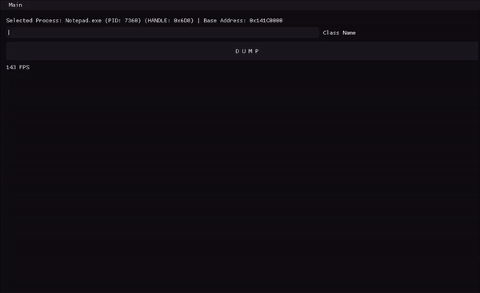

# _Global Offset Dumper_

Universal dumping tool for all kinds of processes

</img>

  
## Usage

It's pretty straight forward, select a process from the main menu, create your classes (and members within), give them their correct signatures and finally dump them into an header file.

Please read the explanation carefully before using the Global Offset Dumper.

## Explanation

#### Process Selection

1. !! When you press select, this will result in the Global Offset Dumper **opening a handle** to the **target process** with **WinAPI function OpenProcess**, this is an **high risk factor** if you are dealing with a **protected process** that is **constantly checking for handles**. (**New options will be added soon**)
2. The main part contains all the processes **-with proper access rights-** to select one.
3. Processes can be filtered which will save time. Just enter the process name you are searching for.
4. If a process you are looking for is not on the list, you can renew the process list. If it's still not there, Global Offset Dumper doesn't have the access rights enough to reach it.

#### Class Members

1. Module of your selected process which your signature will be searched on.
2. How many bytes your offset takes up in the dissasembler after signature.
3. Type name and type size, after you enter a type name, it will fill in the type size automatically with the guessed size (only on primitive datatypes, for other ones just enter it yourself), it it's incorrect, feel free to correct it. The dumper directly puts **this type name** into the header file (for diversity), so enter a correct one.
4. Offset name.
5. Signature the dumper will search on the selected module.
